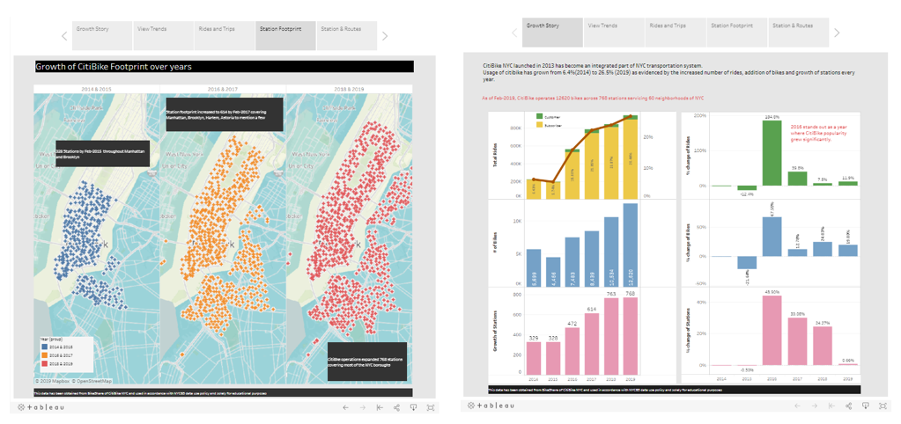
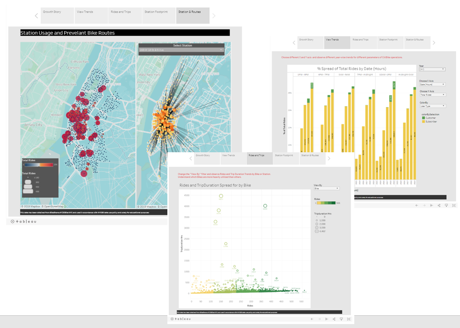

# Citi Bike Analytics - Visualizing growth with Tableau

## Background

[New York Citi Bike](https://en.wikipedia.org/wiki/Citi_Bike) Program is a fast growing green transportation system that is garnering lot of support. Here I am using Tableau to present a visual story of their growth and success.

Since 2013, the Citi Bike Program has implemented a robust infrastructure for collecting data on the program's utilization. Through the team's efforts, each month bike data is collected, organized, and made public on the [Citi Bike Data](https://www.citibikenyc.com/system-data) webpage.

## Approach

**To begin with this story we need to answer some of the question below**

* By what percentage has total ridership grown? 
* How has the proportion of short-term customers and annual subscribers changed?
* What are the peak hours in which bikes are used during summer/winter months? 
* Today, what are the top 10 busiest stations in the city?
* Today, what is the gender breakdown of active participants (Male v. Female)?
* How does the average trip duration change by age?
* What is the average distance in miles that a bike is ridden?
* How variable is the utilization by bike ID?

### Data collection & transformation
For answering above question, the decision was to choose months from number of years. Owing to large dataset and processing limitation, decided to focus on Februrary for years of 2013 to 2019. 

Using Python Pandas, data was cleaned, merged, rolled up into manageable dataset that can used in Tableau. Also, spatial data was extractedi into separate file for map based visuals.

### Tableau Visualization

Using Tableau, a visual plot was created for each of the question that studies trends and concots a growth story. Finally tableau Story board was utilized to showcase Citi Bike growth and it success

Visit this [link](https://public.tableau.com/profile/madhu.swaminathan#!/vizhome/CitiBike_NYC_AllYears/CitiBike-Story) to read the story.

Growth of Citi Bike

Interactive Graphs

